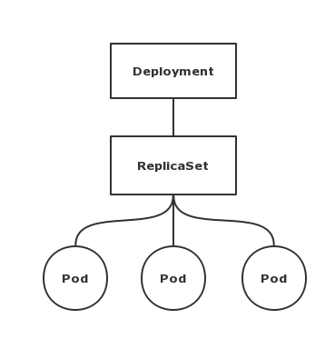
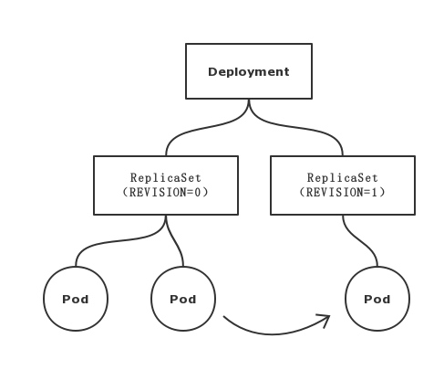

# 经典 PaaS 的记忆：作业副本与水平扩展


## 目录

- [实践环境](#实践环境)

- [实践一：探索 Deployment 和 ReplicaSet 的关系](#实践一)

- [实践二：Deployment 的「水平扩展/收缩」](#实践二)

- [实践三：Deployment 的「滚动更新」](#实践三)

- [总结](#总结)

---


## 实践环境

| 系统及软件 | 版本 |
| :--- | :--- |
| CentOS | 7.6.1810 |
| Kernel | 4.18.9-1.el7.elrepo.x86_64 |
| Kubernetes | 1.11.3 |
| Docker CE | 18.09.0 |

本次实践需要提前搭建好 Kubernetes 集群。

---


## 实践一

探索 Deployment 和 ReplicaSet 的关系。

Deployment 控制器实际操纵的是 ReplicaSet 对象，而不是 Pod 对象。

ReplicaSet 操作的是 Pod 对象，ReplicaSet 对象其实就是由副本数目的定义和一个 Pod 模板组成的。

在所有 API 对象的 Metadata 里，都有一个字段叫作 ownerReference，用于保存当前这个 API 对象的拥有者（Owner）的信息。

所以 Deployment 所管理的 Pod 的 ownerReference 实际上是 ReplicaSet，而这个 ReplicaSet 的 ownerReference 是 Deployment。

### 直接创建 Deployment

1. 编写 nginx-deployment.yaml 文件

   [nginx-deployment.yaml](./nginx-deployment.yaml) 文件内容如下：

   ```bash
   apiVersion: apps/v1
   kind: Deployment
   metadata:
     name: nginx-deployment
     labels:
       app: nginx
   spec:
     replicas: 4
     selector:
       matchLabels:
         app: nginx
     template:
       metadata:
         labels:
           app: nginx
       spec:
         containers:
         - name: nginx
           image: nginx:1.7.9
           ports:
             - containerPort: 80
   ```

2. 创建 Deployment

   ```bash
   $ kubectl create -f nginx-deployment.yaml 
   deployment.apps/nginx-deployment created

   $ kubectl get deployment
   NAME               DESIRED   CURRENT   UP-TO-DATE   AVAILABLE   AGE
   nginx-deployment   4         4         4            4           21s

   $ kubectl describe deployment nginx-deployment
   ...
   NewReplicaSet:   nginx-deployment-67594d6bf6 (4/4 replicas created)
   ...

   $ kubectl get replicaset
   NAME                          DESIRED   CURRENT   READY     AGE
   nginx-deployment-67594d6bf6   4         4         4         1m

   $ kubectl describe replicaset nginx-deployment-67594d6bf6
   ...
   Controlled By:  Deployment/nginx-deployment
   ...
   ```

   可以发现 Deployment 创建之后，会自动创建一个 ReplicaSet，并且这个 ReplicaSet 对象被 Deployment 所控制。

3. 查看 ReplicaSet 和 Pod 的 Owner

   ```bash
   $ kubectl get replicaset nginx-deployment-67594d6bf6 -o yaml
   ...
     ownerReferences:
     - apiVersion: apps/v1
       blockOwnerDeletion: true
       controller: true
       kind: Deployment
       name: nginx-deployment
       uid: 7005ea99-0efa-11e9-befb-0050569fa5b1
   ...

   $ kubectl get pods
   NAME                                READY     STATUS    RESTARTS   AGE
   nginx-deployment-67594d6bf6-dnvkg   1/1       Running   0          27m
   nginx-deployment-67594d6bf6-knn9n   1/1       Running   0          27m
   nginx-deployment-67594d6bf6-nvznv   1/1       Running   0          27m
   nginx-deployment-67594d6bf6-vmn2v   1/1       Running   0          27m

   $ kubectl get pod nginx-deployment-67594d6bf6-dnvkg -o yaml
   ...
     ownerReferences:
     - apiVersion: apps/v1
       blockOwnerDeletion: true
       controller: true
       kind: ReplicaSet
       name: nginx-deployment-67594d6bf6
       uid: 70077c27-0efa-11e9-aff7-0050569f6e43
   ...
   ```

   可以发现， ReplicaSet 的 ownerReference 是 Deployment，Pod 的 ownerReference 实际上是 ReplicaSet。

   所以 Pod 并不是被 Deployment 直接控制，而是 Deployment 控制 ReplicaSet，再由 ReplicaSet 控制 Pod。


### 先创建 ReplicaSet，再创建 Deployment

1. 编写 nginx-replicaset.yaml 文件

   [nginx-replicaset.yaml](nginx-replicaset.yaml) 文件内容如下：

   ```yaml
   apiVersion: apps/v1
   kind: ReplicaSet
   metadata:
     name: nginx-set
     labels:
       app: nginx
   spec:
     replicas: 3
     selector:
       matchLabels:
         app: nginx
     template:
       metadata:
         labels:
           app: nginx
       spec:
         containers:
           - name: nginx
             image: nginx:1.7.9
             ports:
               - containerPort: 80
   ```

2. 创建 ReplicaSet

   ```bash
   $ kubectl create -f nginx-replicaset.yaml 
   replicaset.apps/nginx-set created

   $ kubectl get replicaset -l app=nginx
   NAME        DESIRED   CURRENT   READY     AGE
   nginx-set   3         3         3         12s

   $ kubectl get pods -l app=nginx
   NAME              READY     STATUS    RESTARTS   AGE
   nginx-set-94jnj   1/1       Running   0          51s
   nginx-set-nbdqf   1/1       Running   0          51s
   nginx-set-p84dr   1/1       Running   0          51s

   $ kubectl get rs nginx-set -o yaml
   apiVersion: extensions/v1beta1
   kind: ReplicaSet
   metadata:
     creationTimestamp: 2019-01-03T01:36:02Z
     generation: 1
     labels:
       app: nginx
     name: nginx-set
     namespace: default
     resourceVersion: "4399476"
     ...
   ```

   可以发现，目前这个 ReplicaSet 并没有 ownerReference 字段，也就是说目前还没有被其他的对象所控制。

3. 编写 nginx-deployment.yaml 文件

   [nginx-deployment.yaml](./nginx-deployment.yaml) 文件内容如下：

   ```bash
   apiVersion: apps/v1
   kind: Deployment
   metadata:
     name: nginx-deployment
     labels:
       app: nginx
   spec:
     replicas: 4
     selector:
       matchLabels:
         app: nginx
     template:
       metadata:
         labels:
           app: nginx
       spec:
         containers:
         - name: nginx
           image: nginx:1.7.9
           ports:
             - containerPort: 80
   ```

4. 创建 Deployment

   ```bash
   $ kubectl create -f nginx-deployment.yaml 
   deployment.apps/nginx-deployment created

   $ kubectl describe deployment nginx-deployment
   ...
   NewReplicaSet:   nginx-set (4/4 replicas created)
   ...

   $ kubectl get rs
   NAME        DESIRED   CURRENT   READY     AGE
   nginx-set   4         4         4         10m

   $ kubectl describe rs nginx-set
   ...
   Annotations:    deployment.kubernetes.io/desired-replicas=4
                   deployment.kubernetes.io/max-replicas=5
                   deployment.kubernetes.io/revision=1
   Controlled By:  Deployment/nginx-deployment
   ...

   $ kubectl get rs nginx-set -o yaml
   ...
     ownerReferences:
     - apiVersion: apps/v1
       blockOwnerDeletion: true
       controller: true
       kind: Deployment
       name: nginx-deployment
       uid: eec07674-0ef8-11e9-b3bc-0050569ff066
   ...
   ```

可以发现，Deployment 寻找到符合条件的 ReplicaSet（即携带了 app=nginx 的 ReplicaSet）之后，会更新这个 ReplicaSet 的 Owner，据为己有。 

并且，这个 ReplicaSet 所创建的 Pod 也符合 Deployment 所描述的 Pod 模板，因此就会在此基础上直接进行水平扩展。

如果 ReplicaSet 所创建的 Pod 不符合 Deployment 所描述的 Pod 模板呢？继续进行试验。

### 先创建 ReplicaSet，在创建不同 Pod 模板的 Deployment

1. 编写 nginx-replicaset.yaml 文件

   [nginx-replicaset.yaml](nginx-replicaset.yaml) 文件内容如下：

   ```yaml
   apiVersion: apps/v1
   kind: ReplicaSet
   metadata:
     name: nginx-set
     labels:
       app: nginx
   spec:
     replicas: 3
     selector:
       matchLabels:
         app: nginx
     template:
       metadata:
         labels:
           app: nginx
       spec:
         containers:
           - name: nginx
             image: nginx:1.7.9
             ports:
               - containerPort: 80
   ```

2. 创建 ReplicaSet

   ```bash
   $ kubectl create -f nginx-replicaset.yaml 
   replicaset.apps/nginx-set created

   $ kubectl get replicaset -l app=nginx
   NAME        DESIRED   CURRENT   READY     AGE
   nginx-set   3         3         3         12s
   ```

3. 修改 nginx-deployment.yaml 文件

   修改后的文件内容如下：

   ```bash
   apiVersion: apps/v1
   kind: Deployment
   metadata:
     name: nginx-deployment
     labels:
       app: nginx
   spec:
     replicas: 4
     selector:
       matchLabels:
         app: nginx
     template:
       metadata:
         labels:
           app: nginx
       spec:
         containers:
         - name: nginx
           image: nginx:1.8
           ports:
             - containerPort: 80
   ```

   Deployment 中模板描述的 Pod 的 Nginx 版本为 1.8，而刚才创建的 ReplicaSet 所创建的 Pod 的 Nginx 版本为 1.7.9。

4. 创建 Deployment

   ```bash
   $ kubectl create -f nginx-deployment.yaml 
   deployment.apps/nginx-deployment created

   # 观察 Deployment 的日志，发现发生了滚动更新
   $ kubectl describe deployment nginx-deployment
   NewReplicaSet:   nginx-deployment-7fc9b7bd96 (4/4 replicas created)
   Events:
     Type    Reason             Age   From                   Message
     ----    ------             ----  ----                   -------
     Normal  ScalingReplicaSet  3m    deployment-controller  Scaled up replica set nginx-deployment-7fc9b7bd96 to 2
     Normal  ScalingReplicaSet  3m    deployment-controller  Scaled down replica set nginx-set to 2
     Normal  ScalingReplicaSet  3m    deployment-controller  Scaled up replica set nginx-deployment-7fc9b7bd96 to 3
     Normal  ScalingReplicaSet  3m    deployment-controller  Scaled down replica set nginx-set to 1
     Normal  ScalingReplicaSet  3m    deployment-controller  Scaled up replica set nginx-deployment-7fc9b7bd96 to 4
     Normal  ScalingReplicaSet  3m    deployment-controller  Scaled down replica set nginx-set to 0
   ...
   ```

5. 观察 ReplicaSet 的 Owner

   ```bash
   $ kubectl get replicaset
   NAME                          DESIRED   CURRENT   READY     AGE
   nginx-deployment-7fc9b7bd96   4         4         4         4m
   nginx-set                     0         0         0         5m

   $ kubectl get rs -o yaml
   ...
     name: nginx-deployment-7fc9b7bd96
   ...
       ownerReferences:
       - apiVersion: apps/v1
         blockOwnerDeletion: true
         controller: true
         kind: Deployment
         name: nginx-deployment
         uid: aec7fe35-0f08-11e9-aff7-0050569f6e43
   ...
     name: nginx-set
   ...
       ownerReferences:
       - apiVersion: apps/v1
         blockOwnerDeletion: true
         controller: true
         kind: Deployment
         name: nginx-deployment
         uid: aec7fe35-0f08-11e9-aff7-0050569f6e43
   ...

   # 删除 Deployment 会把自己所控制的 ReplicaSet 都删除
   $ kubectl delete deployment nginx-deployment
   deployment.extensions "nginx-deployment" deleted

   $ kubectl get replicaset
   No resources found.
   ```

   可以发现，Deployment 依然更新了携带标签 app=nginx 的 ReplicaSet 的 ownerReferences。

   但是发现这个 ReplicaSet 所创建的 Pod 不符合 Deployment 模板所描述的 Pod 的信息，所以发生了一次滚动更新：创建了新的 ReplicaSet，并依次删除旧的 Pod，创建新的 Pod。

   接下来的滚动更新的实践会更详细的描述这个过程。

### 总结

Deployment 与它所控制的 ReplicaSet 与这个 ReplicaSet 所控制的 Pod 的关系，实际上是一种「层层」控制的关系。如下图所示：



ReplicaSet 通过「控制器模式」保证系统中 Pod 的个数永远等于指定的个数。这也正是 Deployment 只允许容器的 restartPolicy=Always 的主要原因：只有在容器保证自己始终是 Running 的状态的前提下，ReplicaSet 调整 Pod 的个数才有意义。

在此基础上，Deployment 同样通过「控制器模式」，来操作 ReplicaSet 的个数和属性，进而实现「水平扩展/收缩」和「滚动更新」这两个编排动作。

---

## 实践二

Deployment 的「水平扩展/收缩」。

「水平扩展/收缩」很容易实现，Deployment Controller 只需要修改它所控制的 ReplicaSet 的 Pod 副本个数就可以了。

### 创建 Deployment

1. 编写 nginx-deployment.yaml 文件

   [nginx-deployment.yaml](./nginx-deployment.yaml) 文件内容如下：

   ```bash
   apiVersion: apps/v1
   kind: Deployment
   metadata:
     name: nginx-deployment
     labels:
       app: nginx
   spec:
     replicas: 4
     selector:
       matchLabels:
         app: nginx
     template:
       metadata:
         labels:
           app: nginx
       spec:
         containers:
         - name: nginx
           image: nginx:1.7.9
           ports:
             - containerPort: 80
   ```

2. 创建 Deployment

   ```bash
   $ kubectl create -f nginx-deployment.yaml 
   deployment.apps/nginx-deployment created

   $ kubectl get pods
   NAME                                READY     STATUS    RESTARTS   AGE
   nginx-deployment-67594d6bf6-fg9x4   1/1       Running   0          3s
   nginx-deployment-67594d6bf6-mh6jt   1/1       Running   0          3s
   nginx-deployment-67594d6bf6-pqlc6   1/1       Running   0          3s
   nginx-deployment-67594d6bf6-vpdwc   1/1       Running   0          3s
   ```

### 进行「水平扩展/收缩」

```bash
$ kubectl scale deployment nginx-deployment --replicas=3
deployment.extensions/nginx-deployment scaled

$ kubectl get pods -l app=nginx
NAME                                READY     STATUS    RESTARTS   AGE
nginx-deployment-67594d6bf6-mh6jt   1/1       Running   0          12m
nginx-deployment-67594d6bf6-pqlc6   1/1       Running   0          12m
nginx-deployment-67594d6bf6-vpdwc   1/1       Running   0          12m

$ kubectl scale deployment nginx-deployment --replicas=5
deployment.extensions/nginx-deployment scaled

$ kubectl get pods -l app=nginx
NAME                                READY     STATUS    RESTARTS   AGE
nginx-deployment-67594d6bf6-cg9x6   1/1       Running   0          3s
nginx-deployment-67594d6bf6-gm4cj   1/1       Running   0          3s
nginx-deployment-67594d6bf6-mh6jt   1/1       Running   0          12m
nginx-deployment-67594d6bf6-pqlc6   1/1       Running   0          12m
nginx-deployment-67594d6bf6-vpdwc   1/1       Running   0          12m
```

---

## 实践三

Deployment 的「滚动更新」。

### 创建 Deployment

1. 将 nginx-deployment.yaml 中 replicas 值修改为 3

   ```yaml
   apiVersion: apps/v1
   kind: Deployment
   metadata:
     name: nginx-deployment
     labels:
       app: nginx
   spec:
     replicas: 3
     selector:
       matchLabels:
         app: nginx
     template:
       metadata:
         labels:
           app: nginx
       spec:
         containers:
         - name: nginx
           image: nginx:1.7.9
           ports:
             - containerPort: 80
   ```

2. 创建 Deployment

   ```bash
   # 添加 --record 参数，可以记录每次操作所执行的命令
   $ kubectl create -f nginx-deployment.yaml --record
   deployment.apps/nginx-deployment created

   $ kubectl get deployments
   NAME               DESIRED   CURRENT   UP-TO-DATE   AVAILABLE   AGE
   nginx-deployment   3         3         3            3           8s
   ```

   Deployment 创建后的信息各个字段如下：

   - **DESIRED**：用户期望的 Pod 副本个数（sepc.replicas 的值）；

   - **CURRENT**：当前处于 Running 状态的 Pod 的个数；

   - **UP-TO-DATE**：当前处于最新版本的 Pod 的个数，所谓最新版本指的是 Pod 的 Spec 部分与 Deployment 的 Pod 模板里定义的完全一致；

   - **AVAILABLE**：当前已经可用的 Pod 的个数，即：即是 Running 状态，又是最新版本，并且已经处于 Ready（健康检查正确）状态的 Pod 的个数；

   所以，只有 AVAILABLE 字段，才是用户所期望的最终状态。

### 查看 Deployment 状态的变化

1. 实时查看 Deployment 状态的变化 

   ```bash
   # 在 Deployment 创建时，立即输入此命令
   $ kubectl rollout status deployment nginx-deployment 
   Waiting for deployment "nginx-deployment" rollout to finish: 0 of 3 updated replicas are available...
   Waiting for deployment "nginx-deployment" rollout to finish: 1 of 3 updated replicas are available...
   Waiting for deployment "nginx-deployment" rollout to finish: 2 of 3 updated replicas are available...
   deployment "nginx-deployment" successfully rolled out
   ```

   可以发现，最终 3 个 Pod 都进入 AVAILABLE 状态。

2. 查看 Deployment 所控制的 ReplicaSet

   ```bash
   $ kubectl get rs
   NAME                          DESIRED   CURRENT   READY     AGE
   nginx-deployment-67594d6bf6   3         3         3         3m
   ```

   ReplicaSet 创建后的信息各个字段与 Deployment 的字段含义是相同的。

   所以，Deployment 只是在 ReplicaSet 的基础上添加了 UP-TO-DATE 这个和版本有关的状态字段。

### 触发「滚动更新」

这个时候，如果我们修改了 Deployment 模板，「滚动更新」就会被自动触发。（和实践一中的第三种情况相同）

1. 修改 Deployment 模板

   ```bash
   # 使用 kubectl edit 指令编辑 Etcd 里的 API 对象
   $ kubectl edit deployment nginx-deployment
   ...
       spec:
         containers:
         - image: nginx:1.9.1 # 1.7.9 -> 1.9.1
           imagePullPolicy: IfNotPresent
           name: nginx
           ports:
           - containerPort: 80
   ...

   # 修改之后保存退出
   $ :wq
   deployment.extensions/nginx-deployment edited
   ```

2. 查看 Deployment 状态的变化

   ```bash
   # 修改之后立即执行以下命令
   $ kubectl rollout status deployment nginx-deployment
   Waiting for deployment "nginx-deployment" rollout to finish: 1 out of 3 new replicas have been updated...
   Waiting for deployment "nginx-deployment" rollout to finish: 1 out of 3 new replicas have been updated...
   Waiting for deployment "nginx-deployment" rollout to finish: 1 out of 3 new replicas have been updated...
   Waiting for deployment "nginx-deployment" rollout to finish: 2 out of 3 new replicas have been updated...
   Waiting for deployment "nginx-deployment" rollout to finish: 2 out of 3 new replicas have been updated...
   Waiting for deployment "nginx-deployment" rollout to finish: 1 old replicas are pending termination...
   Waiting for deployment "nginx-deployment" rollout to finish: 1 old replicas are pending termination...
   Waiting for deployment "nginx-deployment" rollout to finish: 1 old replicas are pending termination...
   deployment "nginx-deployment" successfully rolled out

   $ kubectl describe deployment nginx-deployment
   Events:
   Type    Reason             Age   From                   Message
   ----    ------             ----  ----                   -------
   Normal  ScalingReplicaSet  45s   deployment-controller  Scaled up replica set nginx-deployment-67594d6bf6 to 3
   Normal  ScalingReplicaSet  10s   deployment-controller  Scaled up replica set nginx-deployment-6fdbb596db to 1
   Normal  ScalingReplicaSet  9s    deployment-controller  Scaled down replica set nginx-deployment-67594d6bf6 to 2
   Normal  ScalingReplicaSet  9s    deployment-controller  Scaled up replica set nginx-deployment-6fdbb596db to 2
   Normal  ScalingReplicaSet  7s    deployment-controller  Scaled down replica set nginx-deployment-67594d6bf6 to 1
   Normal  ScalingReplicaSet  7s    deployment-controller  Scaled up replica set nginx-deployment-6fdbb596db to 3
   Normal  ScalingReplicaSet  5s    deployment-controller  Scaled down replica set nginx-deployment-67594d6bf6 to 0
   ```

   可以发现，Deployment 「滚动更新」的流程：

   1. 首先，修改了 Deployment 里 Pod 的定义之后，Deployment Controller 会使用这个修改后的 Pod 模板，创建一个新的 ReplicaSet,这个新的 ReplicaSet 的初始 Pod 副本数为 0。而在 Age=45s 的位置，旧的 ReplicaSet(hash=67594d6bf6) 副本数为 3。

   2. 然后，在 Age=10s 的位置，Deployment Controller 开始将这个新的 ReplicaSet（hash=6fdbb596db） 所控制的 Pod 副本数从 0 变为 1，即：「水平扩展」出 1 个副本。

   3. 接着，在 Age=9s 的位置，Deployment Controller 又将旧的 ReplicaSet(hash=67594d6bf6) 所控制的旧 Pod 副本数减少 1 个，即「水平收缩」成 2 个副本。

   4. 然后轮询的执行新的 ReplicaSet 的「水平扩展」与 旧的 ReplicaSet 的「水平收缩」。新的 ReplicaSet 副本数从 1 个 再扩展为 2 个，旧的 ReplicaSet 的副本数由 2 个收缩为 1 个；新的 ReplicaSet 副本数从 2 个 再扩展为 3 个，旧的 ReplicaSet 的副本数由 1 个收缩为 0 个。

   这样，将一个集群中正在运行的多个 Pod 版本，交替地逐一升级的过程，就是「滚动更新」。

3. 查看 Deployment 所控制的 ReplicaSet

   ```bash
   $ kubectl get rs
   NAME                          DESIRED   CURRENT   READY     AGE
   nginx-deployment-67594d6bf6   0         0         0         15m
   nginx-deployment-6fdbb596db   3         3         3         14m
   ```

   可以发现，旧 ReplicaSet 已经被「水平收缩」成了 0 个副本。

### 控制「滚动更新」至指定版本

1. 「滚动更新」至上个版本

   如果新版本有问题，可以回滚到之前的旧版本。

   ```bash
   $ kubectl rollout undo deployment nginx-deployment
   deployment.extensions/nginx-deployment

   $ kubectl get rs
   NAME                          DESIRED   CURRENT   READY     AGE
   nginx-deployment-67594d6bf6   3         3         3         45m
   nginx-deployment-6fdbb596db   0         0         0         44m
   ```

   可以发现，Deployment 会重新维持旧版本的 ReplicaSet。

2. 「滚动更新」至指定版本

   ```bash
   # 首先，使用 kubectl rollout history 命令，查看每次 Deployment 变更对应的版本
   # 之前创建 Deployment 的时候，指定了 --record 参数，所以创建这些版本时执行的 kubectl 命令都会被记录下来
   $ kubectl rollout history deployment nginx-deployment
   deployments "nginx-deployment"
   REVISION  CHANGE-CAUSE
   1         kubectl create --filename=nginx-deployment.yaml --record=true
   2         kubectl create --filename=nginx-deployment.yaml --record=true

   # 然后回滚到指定版本
   $ kubectl rollout undo deployment nginx-deployment --to-revision=1
   deployment.extensions/nginx-deployment
   ```

### 暂停/恢复「滚动更新」

Kubernetes 提供了暂停「滚动更新」的指令，使 Deployment 的多次更新操作，最后只生成一个 ReplicaSet。

1. 更新 Deployment 之前，暂停「滚动更新」

   ```bash
   $ kubectl rollout pause deployment nginx-deployment 
   deployment.extensions/nginx-deployment paused

   # 查看 Deployment 信息，确定已经暂停
   $ kubectl describe deployment nginx-deployment
   ...
     Progressing    Unknown  DeploymentPaused
   ...
   ```

2. 执行多次更新

   ```bash
   # 第一次更新
   $ kubectl edit deployment nginx-deployment
   deployment.extensions/nginx-deployment edited

   # 没有新的 ReplicaSet 被创建
   $ kubectl get replicaset
   NAME                          DESIRED   CURRENT   READY     AGE
   nginx-deployment-67594d6bf6   3         3         3         13m
   nginx-deployment-6fdbb596db   0         0         0         12m

   # 第二次更新
   $ kubectl edit deployment nginx-deployment
   deployment.extensions/nginx-deployment edited

   # 没有新的 ReplicaSet 被创建
   $ kubectl get replicaset
   NAME                          DESIRED   CURRENT   READY     AGE
   nginx-deployment-67594d6bf6   3         3         3         13m
   nginx-deployment-6fdbb596db   0         0         0         12m
   ```

3. 恢复「滚动更新」

```bash
# 恢复滚动更新
$ kubectl rollout resume deployment nginx-deployment
deployment.extensions/nginx-deployment resumed

# 查看 ReplicaSet
NAME                          DESIRED   CURRENT   READY     AGE
nginx-deployment-67594d6bf6   0         0         0         16m
nginx-deployment-6fdbb596db   0         0         0         16m
nginx-deployment-7fc9b7bd96   3         3         3         7s
```

可以发现，只有一个新的 ReplicaSet 被创建，并执行了「滚动更新」。

### 控制 ReplicaSet 版本的个数

Kubernetes 会为同一个 Deployment 保存多个不同的 ReplicaSet。最大保存数量默认为 10 个。

1. 查看默认的 revisionHistoryLimit
   
   ```bash
   $ kubectl get deploy nginx-deployment -o yaml
   ...
     revisionHistoryLimit: 10
   ...
   ```

2. 在 nginx-deployment 中指定保存的版本数量

   ```yaml
   apiVersion: apps/v1
   kind: Deployment
   metadata:
     name: nginx-deployment
     labels:
       app: nginx
   spec:
     replicas: 3
     selector:
       matchLabels:
         app: nginx
     revisionHistoryLimit: 3
   ...
   ```

   这样，如果指定了 spec.revisionHistoryLimit 的个数为 3，那么保存第 4 个 ReplicaSet 时，会删掉最旧的 ReplicaSet。


### 控制「滚动更新」的比例

「滚动更新」的交替进行确保了服务的连续性，如果新版本的 Pod 有问题的话，「滚动更新」就会停止。而旧版本的 Pod 依然会有在线的副本，所以服务并不会收到太大的影响。

为了进一步保证服务的连续性，Deployment Controller 还会确保，在任何时间窗口内，只有指定比例的 Pod 处于离线状态。同时也会确保，在任何时间窗口内，只有指定比例的新 Pod 被创建出来。这两个比例的值都是可以配置的，默认为 DESIRED 值的 25%。

1. 查看默认「滚动更新」配置

   ```bash
   $ kubectl get deployment nginx-deployment -o yaml
   ...
     strategy:
       rollingUpdate:
         maxSurge: 25%
         maxUnavailable: 25%
       type: RollingUpdate
   ...
   ```

   以上配置表示：这个 Deployment 有 3 个 Pod 副本，那么控制器在「滚动更新」的过程中永远会确保至少有 2 个 Pod 处于可用状态，至多有 4 个 Pod 同时存在于集群中。

2. 在 nginx-deployment.yaml 文件中修改「滚动更新」的配置

   ```yaml
   apiVersion: apps/v1
   kind: Deployment
   metadata:
     name: nginx-deployment
     labels:
       app: nginx
   spec:
     replicas: 3
     selector:
       matchLabels:
         app: nginx
     strategy:
       rollingUpdate:
         maxSurge: 1
         maxUnavailable: 1
         # maxSurge: 50%
         # maxUnavailable: 50%
       type: RollingUpdate
   ...
   ```

   也可以配置为具体的数量，以上的配置同样表示控制器在「滚动更新」的过程中永远会确保至少有 2 个 Pod 处于可用状态，至多有 4 个 Pod 同时存在于集群中。

   所以在 RollingUpdateStrategy 配置中，maxSurge 指定的是除了 DESIRED 数量之外，在一次「滚动」中，Deployment 控制器还可以创建多少个新 Pod；而 maxUnavailable 指的是，在一次「滚动」中，Deployment 控制器可以删除多少个旧 Pod。

### 总结



如上图所示，Deployment 的控制器，实际上控制的是 ReplicaSet 的数目，以及每个 ReplicaSet 的属性。

而一个应用的版本，对应的正式一个 ReplicaSet；这个版本应用的 Pod 的数量，则由 ReplicaSet 通过它自己的控制器（ReplicaSet Controller）来保证。

通过这样的多个 ReplicaSet 对象，Kubernetes 就实现了对多个「应用版本」的描述：「应用版本」和 ReplicaSet 一一对应。

---

## 总结

1. Deployment 实际上是一个两层控制器。<br/>
   Deployment 控制 ReplicaSet（版本），ReplicaSet 控制 Pod（副本数）。<br/>
   首先，它通过 ReplicaSet 的个数来描述应用的版本；然后，它再通过 ReplicaSet 的属性来保证 Pod 的副本数量。

2. Deployment 可以控制 ReplicaSet 对 Pod 进行「水平扩展/伸缩」。

3. Deployment 可以控制 ReplicaSet 的版本对 Pod 进行「滚动更新」。